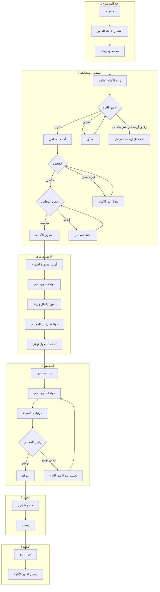
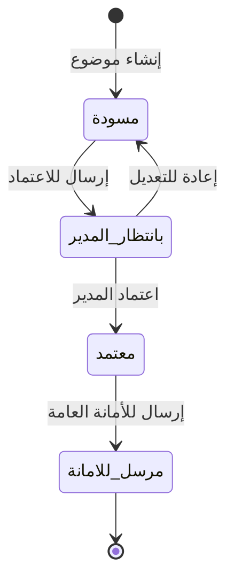
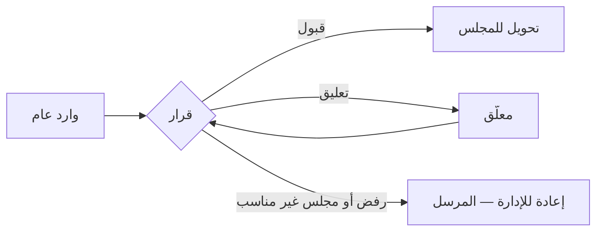
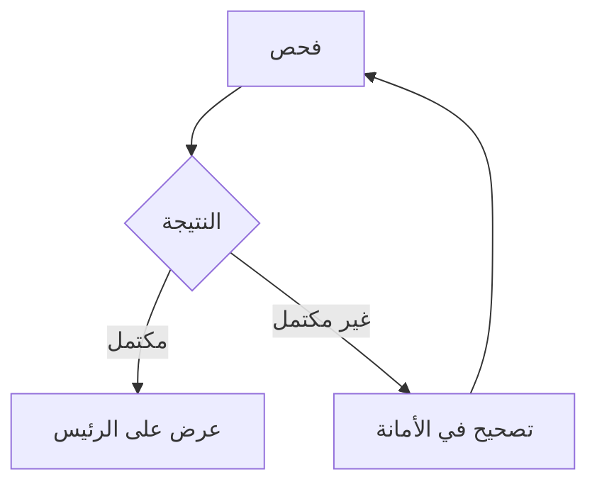
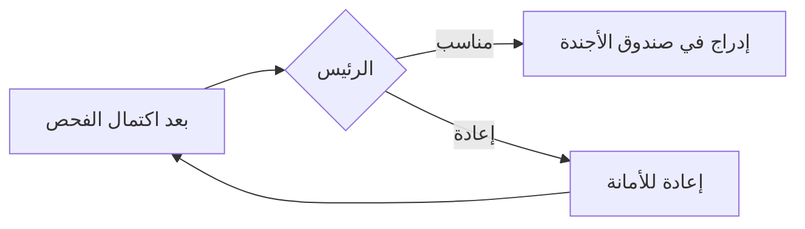
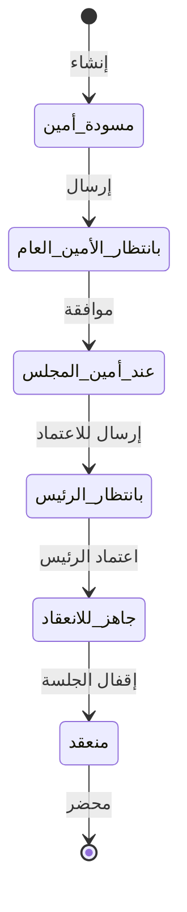
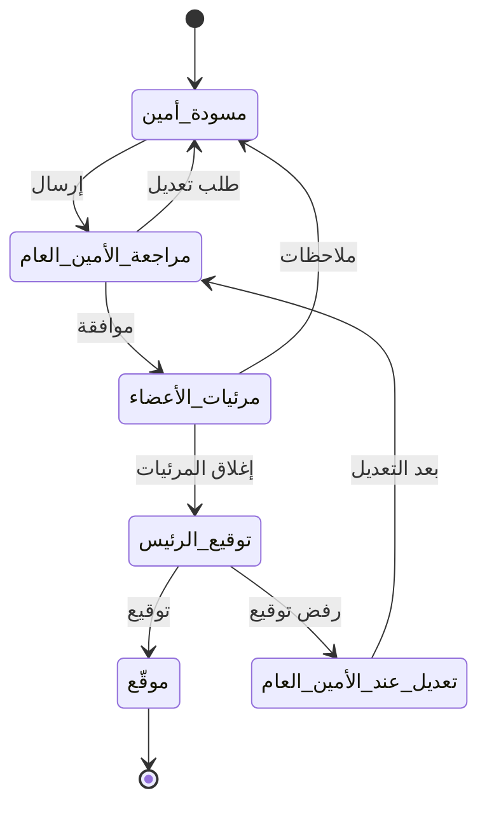
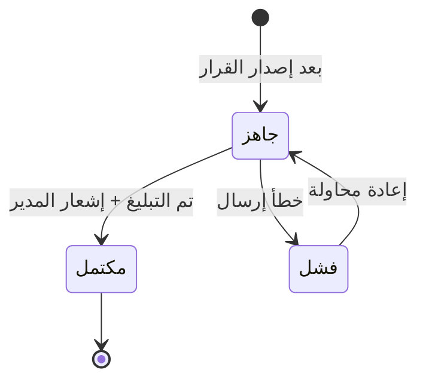
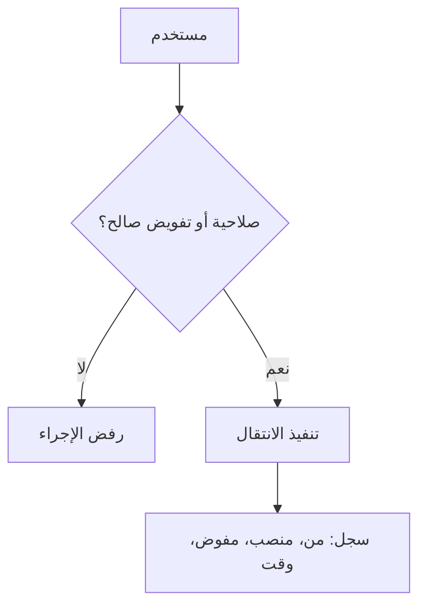

# وثيقة متطلبات المنتج (PRD)
## نظام إدارة المجالس — الإصدار المعتمد (MVP)

| الحقل | القيمة |
|--------|--------|
| الإصدار | 1.0 |
| آخر تحديث | 2026-04-07 |
| الحالة | **معتمدة للتنفيذ (MVP)** — مرجع منتج وتصميم فني |
| اللغة | عربي فقط |
| النطاق | داخلي (بدون موردين خارجيين) |

**سياسة التوثيق:** الإصدار **1.0** يضم **ملاحق تنفيذية (11–14)** لإغلاق فجوات التصميم الفني؛ أي تعديل لاحق يُسجَّل في **§15**.

---

## 1. الهدف والنطاق

### 1.1 الهدف
بناء نظام إلكتروني لإدارة دورة حياة مواضيع المجالس من الإدارات حتى التبليغ، مع صلاحيات وتفويض مرن وتتبع كامل للحالات والرفض والإعادة.

### 1.2 نطاق المنتج (حاليًا)
- إدارة خمس مجالس رئيسية: التوظيف، المالية، التقنية، التشغيل، التسويق.
- مسارات عمل واضحة لكل عملية رئيسية مع دعم حالات الرفض والإعادة والتعليق.
- مصفوفة صلاحيات (أدوار × عمليات × حالات) وتفويض متعدد الأبعاد.
- دور **مدير النظام** (إلزامي): تهيئة شاملة للنظام، مستخدمون وأدوار، قوائم ومجالس وقوالب، وسجلات تدقيق **حسب الشاشة**، و**تدخل تشغيلي** في مسارات المواضيع عند الحاجة (مع تسجيل إلزامي).
- **ربط مستوى السرية** بكل موظف لتحديد أقصى ما يحق له الاطلاع عليه مقارنة بدرجة سرية كل موضوع أو وثيقة.

### 1.3 خارج النطاق أو مؤجّل
- **التكاملات** (ERP/HR/البريد وغيرها): **مؤجّلة** عن الإصدار الأول.
- **التوقيع الإلكتروني القانوني** (بمعنى التوقيع المُصدَّق وفق نظام معتمد): **مؤجّل**؛ في الإصدار الأول يُستخدم **اعتماد/إقرار إلكتروني داخل النظام** لرئيس المجلس على المحضر (انظر 10.1 حرجة).

### 1.4 لوحات المعلومات (داشبورد) — أولوية الإطلاق

- **داشبورد تفاعلي كامل** للأمين العام ولـ **كل أمين مجلس** (نطاق كل أمين يقتصر على مجلسه).
- **مؤشرات أولية** مع **تعريفات الحساب** (معتمدة — 10.2):

| المؤشر | المصدر / طريقة الحساب | الفلاتر |
|--------|-------------------------|---------|
| عدد الموضوعات | عدد سجلات الموضوع في النطاق الزمني والمجلس | مجلس، فترة، حالة |
| عدد الاجتماعات | اجتماعات مُنشأة أو مُنعقدة حسب نوع العداد في الواجهة | مجلس، فترة |
| القرارات | عدد سجلات قرار بحالة `DEC_ISSUED` في الفترة | مجلس، فترة |
| الإعادات | عدد **أحداث إعادة** مسجّلة (إعادة من رئيس، من أمين عام، إرجاع للإدارة، إلخ) — ليس «كل خطوة فرعية» | مجلس، فترة، نوع الإعادة إن وُجد |
| الإدارات | **مستنبط** من حقل الإدارة الطالبة على الموضوع — قائمة ديناميكية | فترة، مجلس |
| الفترات الزمنية | فلتر **من تاريخ — إلى تاريخ** على طوابع الموضوع/القرار/الاجتماع حسب المؤشر | إلزامي مع كل مؤشر |

---

## 2. البنية التنظيمية والأدوار

### 2.1 المجالس
| المجلس |
|--------|
| مجلس التوظيف |
| مجلس المالية |
| مجلس التقنية |
| مجلس التشغيل |
| مجلس التسويق |

### 2.2 الهيكل العام للمسؤوليات
- **الإدارة الطالبة:** تُنشئ الموضوع وتعتمد خروجه نحو **الأمانة العامة لمجالس الشركة**.
- **الأمين العام:** بوابة موحّدة بعد الإدارة على مستوى الشركة؛ يشرف على المجالس الخمس؛ يتولى **التبليغ** بالقرار للإدارة الطالبة.
- **كل مجلس (واحد من الخمسة):** **رئيس مستقل** + **أمين مجلس** + **موظفو أمانة**؛ مسار الموضوع داخل المجلس والفحص والمحضر حتى إصدار القرار.

### 2.3 الوظائف — الدور والمسؤوليات

| الوظيفة / المنصب | الدور باختصار | مسؤوليات رئيسية (حسب النطاق المعتمد) |
|------------------|---------------|----------------------------------------|
| **موظف إداري مختص (الإدارة الطالبة)** | إعداد ملف الموضوع داخل الإدارة | إنشاء وتعديل **مسودة** الموضوع؛ إرفاق المستندات المطلوبة؛ إرسال المسودة لمسار اعتماد مدير الإدارة؛ متابعة التعديلات عند الإعادة من الأمانة العامة أو المجلس؛ **بعد الإرسال:** **اطلاع للقراءة** على حالة موضوع إدارته والسجل الظاهر له دون تنفيذ إجراءات خارج صلاحية الإدارة (10.4). |
| **مدير الإدارة** | الاعتماد الرسمي للموضوع خروجًا من الإدارة | مراجعة المسودة؛ **اعتماد** الرفع؛ **إرسال** الموضوع إلى الأمانة العامة؛ لا يُعتبر الموضوع «مرسلًا» إلا بعد هذا الاعتماد. |
| **الأمين العام لمجالس الشركة** | إشراف مركزي وبوابة بعد الإدارة | **مراجعة جوهرية** لكل موضوع وارد؛ **قبول** وتحويل للمجلس المحدد؛ **تعليق**؛ **رفض** يعيد للإدارة (لا أرشفة نهائية من عنده)؛ **إعادة** للإدارة عند عدم ملاءمة المجلس المقترح؛ **الموافقة** على المحضر وعلى **مسودة الاجتماع** في مساراتها؛ **التبليغ** بالقرار؛ **وصول كامل للنظام** و**تتبع كامل** لجميع المواضيع والمسارات وسجلات التدقيق (مع مراعاة السرية المعتمدة). |
| **أمين المجلس** (لكل مجلس) | تشغيل أمانة مجلس محدد | تنسيق وارد المجلس؛ إسناد الفحص لموظفي الأمانة أو **من يفوّضهم**؛ **إعداد المحضر** وإدارته؛ **إنشاء مسار الاجتماع** ثم التحويل للأمين العام ثم العودة ثم التحويل لرئيس المجلس (انظر 6.5، 9.3)؛ لا يُبدي «قرار مجلس» بذاته بل يُعد الوثائق ويُتابع المسارات. **أمام رئيس المجلس** تظهر جميع الإجراءات القادمة لمساره وكأنها من أمانة المجلس فقط (انظر 2.7). |
| **موظف أمانة مجلس (مختص فحص)** | تنفيذ الفحص الشكلي والموضوعي | إجراء **الفحص**؛ تسجيل النتيجة **مكتمل / غير مكتمل** مع الأسباب؛ طلب استكمال المستندات ضمن أمانة المجلس. |
| **رئيس المجلس** (لكل مجلس) | رئاسة مجلس محدد | بعد اكتمال الفحص: **مناسب** (إدراج نحو صندوق الأجندة) أو **إعادة** مع تحديد النوع (6.4)؛ **اعتماد المحضر** (`MIN_SIGNED`)؛ **إصدار قرار المجلس** في نهاية المسار. |
| **عضو مجلس** | مشاركة في اجتماعات المجلس ومسار المحضر | حضور الاجتماعات عند التكليف؛ **الاطلاع** على المحضر و**إبداء المرئيات** في المرحلة المخصصة؛ لا يملك اعتمادًا نهائيًا للمحضر أو القرار (لرئيس المجلس والمسار المعتمد). |
| **مدير النظام** | إدارة المنصّة والتهيئة والتشغيل الاستثنائي | **إدارة المستخدمين والأدوار والصلاحيات**؛ **التهيئة العامة** (قوائم، مجالس، قوالب، وغيرها حسب تصميم المنتج)؛ **اطلاع على سجلات التدقيق حسب الشاشة/الوحدة** (مجزّأ تقنيًا وليس بالضرورة شاشة واحدة لكل السجلات دفعة واحدة)؛ **التدخل في مسارات المواضيع وجميع الإجراءات التشغيلية** عند الحاجة (تصحيح، إعادة تعيين حالة، دعم فني تنظيمي) مع **تسجيل تدقيق إلزامي** لكل تدخل. لا يُغني دوره عن مسارات الاعتماد الرسمية للأمين العام/رئيس المجلس في الوضع الطبيعي، لكن يملك **صلاحية النظام** لتجاوز الحظر التقني أو إصلاح حالات شاذة وفق سياسة الشركة. |

**ملاحظة:** يمكن لاحقًا إضافة أدوار داعمة (مثل **أمين عام مساعد**). **مقترح مسبق:** عند التفعيل، يكون مستوى الاطلاع والتتبع **مماثلًا للأمين العام** في نطاق الأمانة العامة (مع تفويض/تقييد يحدده مدير النظام)، ولا يخالف العزل الظاهري لرئيس المجلس (2.4).

### 2.4 العزل الظاهري بين رئيس المجلس والأمين العام (متطلب منتج إلزامي)

- **العلاقات التشغيلية بين أمين المجلس والأمين العام** (موافقات، إرجاع محضر، موافقة اجتماع، وغيرها) تعتبر **داخلية** بين الأمانة العامة وأمانة المجلس في واجهاتهما وسجلاتهما التفصيلية.
- **أمام رئيس المجلس:** أي إجراء أو سجل يخص مسار مجلسه يجب ألا يُظهر أن **الأمين العام** تدخل فيه؛ يُعرض للرئيس أن المصدر هو **أمين المجلس** (أو أمانة المجلس) فقط، بما يشمل الإشعارات والقوائم المتعلقة بقراراته.
- **الاستثناء:** سجل التدقيق **الكامل** يبقى يُظهر الجهة الفعلية لكل إجراء لمن يملك الصلاحية (**الأمين العام**، **مدير النظام**، ومسارات التدقيق الإدارية)، بما لا يخالف سياسة السرية.

**نمط تنفيذ معتمد (معماري): طبقة عرض (View / Presentation layer)**  
- **مصدر حقيقة واحد** للأحداث والتدقيق في الخلفية؛ لا تُنسخ الأحداث إلى «سجل مزدوج».  
- عند بناء **واجهة رئيس المجلس** و**إشعاراته**، يُطبَّق **ترشيح/إسناد ظاهري**: الجهة المعروضة كفاعل = **أمانة المجلس** (أو أمين المجلس)، مع الإبقاء على المعرّف الفعلي للحدث في الطبقة الخلفية للتدقيق ولمن يملك الصلاحية.  
- التفاصيل البرمجية (حقول API، تسميات الحقول، قواعد الإشعارات) مُثبَّتة على مستوى المنتج في **§13**؛ أي توسيع تقني لا يغيّر سياسة العرض هذه.

### 2.5 ملخص الصلاحيات حسب الوظيفة (قبل المصفوفة التفصيلية في القسم 7)

| الوظيفة | رفع/مسودة إدارة | وارد أمين عام | فحص مجلس | صندوق أجندة / اجتماع | محضر | قرار | تبليغ |
|---------|------------------|-----------------|------------|----------------------|------|------|-------|
| موظف إداري مختص | إعداد وتعديل | — | — | — | — | — | — |
| مدير إدارة | اعتماد وإرسال | — | — | — | — | — | — |
| الأمين العام | — | قبول/تعليق/رفض/إعادة للإدارة | — | موافقة اجتماع + تتبع كامل | موافقة على المحضر | — | تبليغ + تتبع |
| أمين المجلس | — | — | تنسيق + تفويض فحص | صندوق أجندة/اجتماع (هو أو من يفوّضه) | إعداد وتوزيع | — | — |
| موظف أمانة (فحص) | — | — | تنفيذ الفحص | — | — | — | — |
| رئيس المجلس | — | — | — | موافقة أولى على الأجندة، سحب [سياسة] | توقيع | إصدار | — |
| عضو مجلس | — | — | — | حضور | مرئيات | — | — |
| مدير النظام | — | — | — | تدخل عند الحاجة | تدخل عند الحاجة | تدخل عند الحاجة | تدخل عند الحاجة |

### 2.6 مستوى السرية وصلاحية الاطلاع لكل موظف

- لكل **مستخدم** (موظف) في النظام يُسجَّل **مستوى سرية أقصى للاطلاع** (`مستوى إسناد سرية`) وفق **قائمة مستويات** تُهيَّأ في النظام (مثال مرجعي: عام → داخلي → سري → … — التسميات والدرجات تُحدَّد بالتهيئة).
- **درجة سرية الموضوع** (المذكورة في الحد الأدنى لبيانات الموضوع) تُقارَن مع مستوى المستخدم: النظام **يمنع** الاطلاع أو تنفيذ إجراء على موضوع/مرفق/محضر **أعلى سريةً** من مستوى المستخدم، ما لم تُستثنَ سياسة لاحقًا (مثل تدخل مدير نظام بمسار تدقيق مسجّل).
- **التطبيق:** قوائم البحث، التنبيهات، والفتح للتفاصيل تُفلتر آليًا؛ محاولات الوصول غير المسموح تُسجَّل في التدقيق.
- **التهيئة:** تعريف المستويات وترتيبها من **مدير النظام**؛ إسناد مستوى لكل موظف عند إنشاء/تعديل المستخدم.
- **تغيير درجة سرية الموضوع بعد الإرسال:** **لا يُسمح** بالتعديل التلقائي؛ يُسمح فقط بمسار **استثنائي** بصلاحية **الأمين العام** مع **سبب إلزامي** وتسجيل في التدقيق، وبما لا يخفض السرية دون موافقةات إضافية تُحدَّد في التصميم إن لزم.

### 2.7 ملاحظات تنظيمية (قرارات مسجلة)
- تحديد **المجلس المستهدف** يقع على **الإدارة** عند الرفع.
- إذا كان المجلس المقترح غير مناسب فعليًا: **الأمين العام يعيد الموضوع** (مسار تصحيح/إعادة توجيه — تفصيل الحالات في قسم سير العمل).

---

## 3. الحد الأدنى من بيانات الموضوع

| الحقل | إلزامي | ملاحظات |
|--------|--------|---------|
| عنوان الموضوع | نعم | |
| المرفقات | نعم — **حد أدنى** | **افتراضي مقترح:** **ملف واحد على الأقل**؛ يُضبط العدد (ويمكن لاحقًا إضافة حد حجم إجمالي) في **التهيئة**؛ يمكن جعل الحد **موحّدًا للشركة** أو **للمجلس** لاحقًا إن لزم |
| درجة السرية | نعم | |
| المجلس | نعم | مقترح من الإدارة |

**قرار:** لا تُضاف للموضوع في النطاق الحالي حقول إضافية (وصف تفصيلي، ميزانية، مخاطر، موعد مطلوب).

### 3.1 بيانات المستخدم المرتبطة بالسرية

| الحقل | إلزامي | ملاحظات |
|--------|--------|---------|
| مستوى السرية الأقصى للاطلاع | نعم | يطابق أحد مستويات السرية المعرفة في النظام؛ يُراجع عند تغيير المنصب أو الدور. |

---

## 4. دورة حياة الموضوع (مستوى عالٍ)

```
الإدارة (مسودة → اعتماد مدير الإدارة → إرسال)
    → الأمانة العامة (مراجعة جوهرية)
    → المجلس المحدد (فحص أمانة المجلس)
    → رئيس المجلس (قرار أولي بعد الفحص)
    → صندوق الأجندة (بعد موافقة الرئيس)
    → جدولة اختيار المواضيع ضمن اجتماع
    → الاجتماع والقرار
    → مسار المحضر والتوقيع وإصدار القرار
    → التبليغ من الأمين العام إلى الإدارة الطالبة أصلًا
```

---

## 5. العمليات الرئيسية (حيز المنتج)

1. رفع الموضوع  
2. استقبال الموضوع  
3. الاجتماعات  
4. المحاضر  
5. القرارات  
6. التبليغات  

**متطلب تصميم:** لكل عملية يُفترض **Workflow** (حالات، انتقالات، رفض، إعادة، تعليق) و**مخطط** (نصي أو Mermaid في وثائق التصميم). التفاصيل الكاملة في **القسم 9**.

---

## 6. تفاصيل مسارات تم الاتفاق عليها

### 6.1 الإدارة — مسودة وإرسال
- **مسموح بمسودة ثم إرسال رسمي.**
- التسلسل: الموظف المختص يُعد المسودة → تُرفع إلى **مدير الإدارة** → يعتمدها → تُرسل إلى **الأمانة العامة**.
- **التوقيع/الاعتماد الرسمي داخل الإدارة:** **مدير الإدارة** فقط (للرفع المعتمد).

### 6.2 الأمانة العامة — الأمين العام
- نوع المراجعة: **جوهرية** (ليست توجيهًا فقط ولا شكلية فقط).
- خيارات على الأقل:
  - **قبول** وتحويل إلى **المجلس المحدد**؛
  - **تعليق** مؤقت للنظر؛
  - **رفض** مع **توضيح الأسباب** — **يعود الموضوع دائمًا إلى الإدارة (المرسل)**؛ **لا يوجد** مسار أرشفة نهائية من الأمين العام دون إعادة للإدارة.
- **تعارض المجلس:** إذا اختلف المجلس المقترح عن المناسب — **إعادة للإدارة** لتصحيح المسار.
- **موضوع بقي في حالة إعادة للإدارة** دون رغبة في المتابعة: **مدير الإدارة** يستطيع **إغلاق/أرشفة** الملف من طرف الإدارة وفق **10.4**.

### 6.3 المجلس — الفحص (أمانة المجلس)
- المنفّذ: **موظف مختص في أمانة المجلس** (فحص موضوعي وشكلي).
- نتيجة الفحص:
  - **مكتمل**؛
  - **غير مكتمل** مع **توضيح الأسباب**.

### 6.4 رئيس المجلس — بعد الفحص
ثلاث خيارات:
- **مناسب** (الانتقال نحو الإدراج في صندوق الأجندة)؛
- **إعادة** إلى **أمانة المجلس** للمعالجة ثم **إعادة عرض** على الرئيس؛ عند اختيار الإعادة **يُلزم الرئيس بتحديد نوع الإعادة** (معتمد):  
  - **إعادة فحص كاملة** — يعاد المسار إلى خطوة الفحص كما لو كان طلبًا جديدًا من ناحية الفحص؛ أو  
  - **تصحيح مسار فقط** — تعديلات دون إعادة فحص كامل إلا إذا تطلّبها المحتوى لاحقًا.

### 6.5 صندوق الأجندة والاجتماع
- لكل مجلس مجموعة مواضيع؛ الموضوع يُدرج بعد **موافقة رئيس المجلس** على الدخول في الصندوق.
- **صندوق الأجندة وإنشاء الاجتماع وربط المواضيع:** **أمين المجلس** أو **من يفوّضه أمين المجلس** صراحةً.
- **مسار الاجتماع (معتمد):** **أمين المجلس** يُنشئ مسودة الاجتماع ويُحيلها إلى **الأمين العام** للموافقة → تعود إلى **أمين المجلس** → تُحال إلى **رئيس المجلس** للموافقة والاعتماد. **أمام الرئيس** يظهر المسار كقادم من أمانة المجلس (2.4).
- تُحدَّد المواضيع الداخلة من **صندوق الأجندة** ضمن صلاحية الأمانة كما يقرر المنتج.
- **سحب موضوع** من جدول اجتماع مُخطّط: يعود الموضوع إلى **صندوق الأجندة** (سلوك ثابت). **الصلاحية:** **أمين المجلس** أو من يفوّضه (لا يُشترط موافقة رئيس المجلس للسحب التشغيلي؛ يُسجّل السحب في التدقيق).
- **ترتيب المواضيع في صندوق الأجندة:** افتراضي **FIFO** (حسب تاريخ دخول الصندوق)؛ **أمين المجلس** يستطيع **إعادة ترتيبًا يدويًا** لجدولة الاجتماعات؛ أي سياسة أولوية إضافية تُضاف في التهيئة لاحقًا إن لزم.
- **تأجيل اجتماع:** المواضيع المرتبطة **تعود إلى صندوق الأجندة**.
- **مؤجل داخل الجلسة:** الموضوع **يعود إلى صندوق الأجندة**.
- **إلغاء اعتماد** الموضوع بعد اعتماد مدير الإدارة وقبل الإرسال للأمانة: **مسموح**؛ الصلاحية **لمدير الإدارة** فقط.

### 6.6 القرار
- نوع المخرج: **قرار مجلس** مرتبط **بكل موضوع** داخل الاجتماع عند الحاجة (يمكن أن يصدر أكثر من قرار في نفس المحضر/الاجتماع — قرار لكل بند موضوعي). **التبليغ** يُنفَّذ **لكل قرار** نحو **الإدارة الطالبة** لذلك الموضوع.
- **إلغاء أو استبدال قرار بعد `DEC_ISSUED`:** **خارج نطاق الإصدار الأول** — لا مسار نظامي؛ القرار المُصدَر يبقى سجلًا نهائيًا في النظام حتى يُعرَّف مسار لاحقًا (انظر 10.1).

### 6.7 المحضر — مسار معتمد
1. **أمين المجلس** يُعد المحضر.
2. تُرسل نسخة إلى **الأمين العام** للموافقة.
3. تعود إلى **أمين المجلس**.
4. يُرسل للأعضاء للاطلاع وإبداء المرئيات.
5. يعود إلى **أمين المجلس**.
6. يُحال إلى **رئيس المجلس** للتوقيع و**إصدار القرار**.
7. إن **رفض رئيس المجلس التوقيع** أو طلب تعديلًا جوهريًا: يعود المحضر إلى **الأمين العام** للتعديل (وليس مسارًا نهائيًا عند الرئيس فقط)؛ ثم يستمر المسار وفق الخطوات أعلاه. **أمام الرئيس** يظهر التفاعل مع أمانة المجلس حسب 2.4.

### 6.8 التبليغ
- بعد إصدار القرار: تنفيذ التبليغ بحالة **«تم التبليغ»** من **الأمين العام** إلى **الإدارة الطالبة** لكل موضوع/قرار.
- **مدير الإدارة** يستلم **إشعارًا** بوجود تبليغ بالقرار **وتفاصيله** (القرار المبلَّغ).
- **فشل الإرسال:** حالة `NOTIF_FAIL`؛ **تنبيه**؛ **إعادة محاولة آلية** بعدد **محدد في التهيئة** (مقترح افتراضي: **3 محاولات**) مع **فترة انتظار** بين المحاولات (مقترح: **15 دقيقة** أو يوم عمل واحد حسب قناة التسليم الداخلية). **التسوية اليدوية:** **الأمين العام** يملك تأكيد «تم التبليغ» بعد إثبات التسليم خارج النظام أو إصلاح العطل؛ **مدير النظام** يستطيع تصحيح الحالة في حالات شاذة (مع تدقيق).
- **نجاح التبليغ:** انتقال إلى `NOTIF_DONE` عند **نجاح القناة الداخلية** (عرض السجل في بوابة الإدارة / تأكيد الاستلام المنطقي حسب التصميم) — دون اشتراط بريد خارجي في v1 (1.3).

---

## 7. الصلاحيات والتفويض

### 7.1 حالات التفويض في النظام (دورة حياة التفويض)

يُسجَّل كل تفويض ككيان مستقل مع **سجل تدقيق**؛ الحالات التالية تغطي السيناريوهات المعتمدة (إجازة، مهمة، تدريب، وغيرها):

| الحالة | المعنى | انتقال نموذجي |
|--------|--------|----------------|
| `DELEGATION_DRAFT` | مسودة تفويض غير مفعّلة | حفظ → `PENDING_ACTIVATION` أو حذف |
| `PENDING_ACTIVATION` | جدولة بتاريخ بدء مستقبل [اختياري إن رُغب] | عند البدء → `ACTIVE` |
| `ACTIVE` | ساري ضمن نافذة زمنية ونطاق محدد | انتهاء المدة → `EXPIRED`؛ إلغاء → `REVOKED`؛ استبدال → `SUPERSEDED` |
| `SUSPENDED` | موقوف يدويًا مؤقتًا دون حذف | استئناف → `ACTIVE`؛ إلغاء → `REVOKED` |
| `EXPIRED` | انتهى بتاريخ الانتهاء (آليًا) | لا رجوع إلا بتفويض جديد |
| `REVOKED` | ملغى صراحةً قبل أو أثناء السريان | نهاية صلاحية المفوَّض فورًا |
| `SUPERSEDED` | استُبدل بتفويض أحدث لنفس المنصب/النطاق | الأحدث فقط يُعتد به في التحقق |

**قواعد تزاحم التفويضات (معتمدة):**
- **لا يجوز** وجود أكثر من تفويض **نشط** لنفس **الإجراء** ونفس **نطاق الموضوع** لنفس المفوَّض إلا بعد إنهاء أو إلغاء السابق (سياسة صريحة).
- إذا تعارض نطاقان: **الأكثر تحديدًا** (عملية/نوع موضوع) يعلو على التفويض العام للدور، ما لم تُعرّف سياسة أولوية أخرى.
- التنفيذ بصلاحية مفوَّض: يُسجَّل **المنصب الأصلي + اسم المفوض + مرجع التفويض**.

### 7.2 نطاق التفويض (ما يُفوَّض)

| نوع النطاق | الوصف | مثال |
|------------|--------|------|
| **دور كامل** | جميع الإجراءات المسموحة لذلك الدور داخل النظام | تفويض الأمين العام أثناء الإجازة |
| **عملية محددة** | إجراء واحد أو مجموعة من القائمة المعتمدة (مثل: فحص موضوع، اعتماد محضر) | تفويض مهمة مؤقتة |
| **نوع موضوع / تصنيف** | ينحصر التفويض في مواضيع ضمن تصنيف أو مجلس أو وسم | تفويض تدريب على مجلس واحد |

- **تفويض مؤقت:** `من تاريخ` و`إلى تاريخ` إلزاميان للتفعيل الآلي للانتهاء؛ **حد أقصى للمدة** يُعرَّف في **التهيئة** (مقترح افتراضي: **90 يومًا** لكل تفويض ما لم تُنقص السياسة).
- **من يُنشئ التفويض:** **صاحب الدور الأصلي** (أو مدير النظام نيابة عن تنظيم معتمد)؛ **من يلغي:** صاحب الدور، **مدير النظام** (إلغاء إداري)، أو انتهاء المدة.
- **تداخل المهام:** يُطبَّق حظر التعدد الوارد أعلاه (7.1).

### 7.3 العرض في السجل والواجهات
- يظهر **المنصب الأصلي** مع **اسم المفوض** عند تنفيذ إجراء بالنيابة.
- يُمنع إخفاء كون الإجراء تم **بالتفويض** في سجل التدقيق.

### 7.4 فصل الواجبات (SoD)
- **ليس شرطًا** في السياسة الحالية؛ يمكن تفعيل قواعد SoD لاحقًا كخيار تشغيلي.

### 7.5 مصفوفة الصلاحيات — العمليات × الوظائف

**مفتاح:** ✓ = مسموح افتراضيًا | ✓* = عبر تفويض صريح فقط | — = غير مناط بهذا الدور | [قيد] = يحتاج سياسة/تفصيل | **M** = مدير النظام (تدخل/تهيئة كما في العمود الأخير)

| العملية / الإجراء | موظف إداري | مدير إدارة | الأمين العام | أمين مجلس | موظف فحص | رئيس مجلس | عضو مجلس | مدير النظام |
|-------------------|------------|------------|--------------|-----------|-----------|------------|----------|-------------|
| إنشاء/تعديل مسودة موضوع (إدارته) | ✓ | ✓ | — | — | — | — | — | تدخل استثنائي [M] |
| اعتماد وإرسال موضوع من الإدارة | — | ✓ | — | — | — | — | — | تدخل استثنائي [M] |
| قبول / تعليق / رفض / إعادة (وارد عام) | — | — | ✓ | — | — | — | — | تدخل استثنائي [M] |
| إسناد الفحص داخل أمانة المجلس | — | — | — | ✓ | — | — | — | تدخل استثنائي [M] |
| تنفيذ الفحص (مكتمل/غير مكتمل) | — | — | — | ✓* | ✓ | — | — | تدخل استثنائي [M] |
| عرض رئيس المجلس (مناسب/إعادة) | — | — | — | — | — | ✓ | — | تدخل استثنائي [M] |
| إدخال/سحب من صندوق أجندة المجلس | — | — | — | ✓ أو مفوَّض منه | — | — | — | تدخل استثنائي [M] |
| إنشاء اجتماع وربط مواضيع + مسار الموافقات | — | — | موافقة على مسودة الاجتماع | إنشاء ثم إكمال بعد GS | — | موافقة نهائية | — | تدخل استثنائي [M] |
| إعداد محضر وتوزيعه للمرئيات | — | — | — | ✓ | — | — | — | تدخل استثنائي [M] |
| موافقة الأمين العام على المحضر | — | — | ✓ | — | — | — | — | تدخل استثنائي [M] |
| إبداء مرئيات على المحضر | — | — | — | — | — | — | ✓ | تدخل استثنائي [M] |
| توقيع محضر وإصدار قرار | — | — | — | — | — | ✓ | — | تدخل استثنائي [M] |
| تبليغ القرار للإدارة الطالبة | — | — | ✓ | — | — | — | — | تدخل استثنائي [M] |
| إدارة المستخدمين والأدوار والربط التنظيمي | — | — | — | — | — | — | — | ✓ |
| التهيئة العامة (قوائم، مجالس، قوالب، مستويات سرية، …) | — | — | — | — | — | — | — | ✓ |
| عرض سجلات التدقيق | — | — | — | — | — | — | — | ✓ حسب الشاشة/الوحدة |

**ربط بالحالات:** لا يُعرض زر/إجراء في الواجهة إلا إذا كانت حالة الموضوع/المحضر/الاجتماع تسمح به **و** كانت الصلاحية أو التفويض ساريًا **و** كان **مستوى سرية المستخدم** يسمح بالاطلاع (انظر 2.6 والقسم 9 للحالات). استثناء: **مدير النظام** قد يُجري إجراءات تصحيحية وفق **M** مع تسجيل إلزامي (9.8.10).

### 7.6 مصفوفة تكميلية — حالات الموضوع × من يملك الانتقال

| حالة الموضوع (مختصر) | جهات مسموح لها بالانتقال التالي [افتراض] |
|------------------------|------------------------------------------|
| مسودة / بانتظار مدير الإدارة | موظف إداري، مدير إدارة |
| وارد الأمانة العامة | الأمين العام (+ مفوَّض) |
| عند أمانة المجلس / قيد الفحص | أمين المجلس، موظف الفحص (+ مفوَّض) |
| عند رئيس المجلس (بعد الفحص) | رئيس المجلس (+ مفوَّض) |
| في صندوق الأجندة / ربط باجتماع | **أمين المجلس** أو من يفوّضه؛ **رئيس المجلس**: موافقات مناسب/اجتماع حسب المسار لا سحبًا تشغيليًا من الصندوق إن فرّق المنتج بين الاثنين |
| أي حالة (دعم تشغيل / تصحيح) | مدير النظام — انتقال يدوي مسموح بسياسة التدخل (9.8.10) |

---

### 7.7 مدير النظام — صلاحيات ملخّصة

| المحور | القرار المعتمد |
|--------|----------------|
| المستخدمون والأدوار | إدارة كاملة (إنشاء، تعديل، تعطيل، ربط بدور ووظيفة ومستوى سرية). |
| التهيئة العامة | **كل ما يلزم لضبط النظام:** قوائم، مجالس، قوالب (محاضر/تبليغات)، مستويات السرية، **حد أدنى للمرفقات**، وغيرها من معلمات المنتج. |
| سجلات التدقيق | الاطلاع **حسب الشاشة أو الوحدة** (تقسيم مجزّأ في الواجهة؛ ليس شرطًا شاشة واحدة لكل الأحداث). |
| مسارات المواضيع | **يتدخل في جميع المسارات والإجراءات** عند الحاجة (إصلاح، إعادة تعيين، دعم حالات شاذة) مع **إلزامية** تسجيل التدخل في سجل التدقيق (من، ماذا، متى، سبب، قبل/بعد). **إشعار** الجهات المعنية عند التدخل: **غير مطلوب** (لا حاجة وفق القرار المعتمد). |
| السرية | يُنصح بأن يبقى تدخل مدير النظام على مواضيع **عالية السرية** نادرًا ومُبرَّرًا؛ السلوك الفني الدقيق (منع/سماح بالاطلاع) يُفصَّل في التصميم مع مراعاة الحوكمة. |

### 7.8 الأمين العام — وصول وتتبع

| البند | القرار المعتمد |
|--------|----------------|
| النطاق | **وصول كامل** إلى بيانات ومسارات النظام **وتتبع كامل** (مع مراعاة السرية والصلاحيات المعتمدة). |
| التدقيق | رؤية **كامل** لسجل الأحداث الفعلي (بما فيه دوره هو في المسارات)؛ يختلف عن **رئيس المجلس** الذي تُصفّى واجهته وفق 2.4. |

---

## 8. متطلبات غير وظيفية

### 8.1 عام

| البند | القرار |
|--------|--------|
| اللغة والواجهة | عربي فقط؛ دعم **RTL** في الواجهات؛ التواريخ وفق **التقويم الميلادي** ما لم يُحدَّد غير ذلك في التهيئة. |
| البيئة | **داخلية** (شبكة الشركة / VPN حسب سياسة العميل). |
| الموردون الخارجيون | لا وصول مباشر للبيانات من خارج المنظومة المعتمدة. |

### 8.2 الأمان والسرية

| البند | المتطلب |
|--------|----------|
| المصادقة | تكامل مع **دليل هوية الشركة** (SSO/LDAP/ما يعادله) — تفصيل تقني في مرحلة التنفيذ؛ **لا كلمات مرور مضمّنة** في الوثيقة. |
| التفويض والصلاحيات | فرض صلاحيات على **كل** استدعاء API وكل شاشة (رفض افتراضي). |
| السرية | تطبيق **2.6** على كل الكيانات الحساسة؛ تشفير أثناء النقل (**HTTPS**) داخل الشبكة الداخلية حسب سياسة الأمن. |
| سجل التدقيق | **غير قابل للحذف** للمستخدم النهائي؛ يُسجَّل: المستخدم، الدور/التفويض، الكيان، الإجراء، الطابع الزمني، القيم قبل/بعد عند التغيير. |

### 8.3 التوفر والأداء والنسخ (أهداف MVP)

| البند | الهدف المرجعي (قابل للضبط مع البنية) |
|--------|----------------------------------------|
| التوفر | **99%** ساعات العمل الرسمية (استثناء صيانة مخطّطة تُعلَن مسبقًا). |
| زمن الاستجابة | الصفحات التفاعلية الأساسية: **< 3 ثوانٍ** في الظروف الطبيعية للشبكة الداخلية. |
| النسخ الاحتياطي | **يومي** كحد أدنى؛ **RPO ≤ 24 ساعة**؛ استعادة تُختبر **ربع سنويًا** (إجراء تشغيلي). |
| الاحتفاظ بالبيانات | سجلات التدقيق والمواضيع والقرارات: **7 سنوات** افتراضيًا ما لم تفرض الجهة مدة أخرى — **قابلة للتهيئة** من مدير النظام ضمن حدود القانون. |

### 8.4 قابلية الصيانة والمراقبة

| البند | المتطلب |
|--------|----------|
| السجلات التقنية | تسجيل أخطاء التطبيق والأداء (مستوى يُحدد في التنفيذ) لدعم التشخيص. |
| التهيئة | المعلمات الرقمية في **§14**؛ نموذج البيانات في **§11**؛ مرجع الحالات في **§12**؛ مواصفة العزل في **§13** — قابلة للضبط دون إعادة بناء الكود حيث أمكن. |

---

## 9. مخططات سير العمل (Workflows)

> **ملاحظة تصميم:** المخططات تربط المتطلبات المعتمدة. حيث لم يُحدد مسار صريح، يُشار إلى **افتراض تصميمي** بين قوسين `[افتراض]` — يُراجع عند التنفيذ الفني دون تغيير القرارات المُثبتة في §6–§7 و§9.8.

**معالجة الرفض والإعادة والتعليق:** مراجعة شاملة وموحّدة لسلوك النظام في **القسم 9.8** (بعد تعريف الإجراءات أدناه).

### 9.0 نظرة شاملة — رحلة الموضوع بين العمليات الست



---

### 9.1 إجراء «رفع الموضوع» (الإدارة)

**الفاعلون:** موظف مختص، مدير الإدارة.

| الحالة | الوصف |
|--------|--------|
| `DRAFT` | مسودة قيد الإعداد |
| `PENDING_MANAGER` | مُرسَلة لاعتماد مدير الإدارة |
| `APPROVED` | اعتمدها المدير وجاهزة للإرسال |
| `SENT_TO_GS` | أُرسلت إلى الأمانة العامة (خروج من مسار الإدارة) |

**انتقالات رفض/إعادة:**

| من | الحدث | إلى | ملاحظات |
|----|--------|-----|---------|
| `PENDING_MANAGER` | رفض/إعادة للتعديل | `DRAFT` | مع سبب |
| `APPROVED` | **إلغاء اعتماد** قبل الإرسال (مدير الإدارة فقط) | `DRAFT` | مسموح |



---

### 9.2 إجراء «استقبال الموضوع» (الأمانة العامة → المجلس حتى جاهزية الأجندة)

يغطي: وصول الطلب للأمين العام، المراجعة الجوهرية، التحويل لأمانة المجلس، الفحص، وقرار رئيس المجلس **قبل** ربط الاجتماع.

| الحالة | الوصف |
|--------|--------|
| `INBOX_GS` | وارد الأمانة العامة |
| `GS_REVIEW` | قيد المراجعة الجوهرية |
| `SUSPENDED` | معلّق بقرار الأمين العام |
| `RETURNED_DEPT` | **أي رفض أو إعادة من الأمين العام** — يعود الموضوع **دائمًا** إلى **الإدارة (المرسل)** مع الأسباب؛ **لا أرشفة** من الأمين العام |
| `WITH_COUNCIL` | عند أمانة المجلس المحدد |
| `EXAM_IN_PROGRESS` | قيد الفحص الشكلي/الموضوعي |
| `EXAM_COMPLETE` | فحص مكتمل |
| `EXAM_INCOMPLETE` | فحص غير مكتمل (أسباب) |
| `PRESIDENT_REVIEW` | عرض على رئيس المجلس |
| `RETURNED_COUNCIL` | إعادة من الرئيس لأمانة المجلس ثم إعادة عرض |
| `IN_AGENDA_BOX` | مؤهل لصندوق الأجندة بعد «مناسب» |

**قرارات الأمين العام:**



**قرارات الفحص (أمانة المجلس):**



**قرارات رئيس المجلس:**



---

### 9.3 إجراء «الاجتماعات»

**مسار الاعتماد (معتمد):** **أمين المجلس** يُنشئ **مسودة اجتماع** → **الأمين العام** يوافق → تعود إلى **أمين المجلس** لإكمال الربط والتفاصيل → **رئيس المجلس** للموافقة والاعتماد النهائي للانعقاد. واجهة رئيس المجلس تظهر الطلب قادمًا من **أمانة المجلس** (2.4).

| الحالة | الوصف |
|--------|--------|
| `MEETING_DRAFT_SEC` | مسودة من أمين المجلس (أو من يفوّضه) |
| `MEETING_GS_APPROVAL` | بانتظار موافقة الأمين العام على المسودة |
| `MEETING_BACK_SEC` | عند أمين المجلس بعد موافقة الأمين العام |
| `MEETING_PRES_APPROVAL` | بانتظار موافقة واعتماد رئيس المجلس |
| `AGENDA_LINKED` | مواضيع مربوطة من صندوق الأجندة |
| `MEETING_HELD` | تم الانعقاد |
| `MEETING_CANCELLED` | أُلغي |
| `MEETING_ADJOURNED` | مؤجل — **المواضيع تعود لصندوق الأجندة** |

**سحب موضوع من جدول اجتماع:** يعود الموضوع إلى **صندوق الأجندة** (ثابت).



**مؤجَل داخل الجلسة:** الموضوع **يعود إلى صندوق الأجندة** (معتمد).

---

### 9.4 إجراء «المحضر»

| الحالة | الوصف |
|--------|--------|
| `MIN_DRAFT` | مسودة من أمين المجلس |
| `MIN_GS_REVIEW` | لدى الأمين العام للموافقة |
| `MIN_GS_RETURNED` | أعيد لأمين المجلس بتعديلات |
| `MIN_MEMBERS_CONSULT` | لدى الأعضاء للمرئيات |
| `MIN_TO_PRESIDENT` | عند رئيس المجلس للتوقيع |
| `MIN_PRES_REJECT` | رفض التوقيع — عند **الأمين العام** للتعديل |
| `MIN_SIGNED` | موقّع |



---

### 9.5 إجراء «القرارات»

القرار **قرار مجلس**؛ يُصدر مع المحضر من رئيس المجلس.

| الحالة | الوصف |
|--------|--------|
| `DEC_DRAFT` | مسودة قرار مرتبطة بموضوع/اجتماع/محضر |
| `DEC_ISSUED` | صادر ومُرقّم — **نهائي في نطاق الإصدار الأول** (لا استبدال نظامي لاحقًا حتى يُعرَّف إصدار لاحق) |


---

### 9.6 إجراء «التبليغات»

| الحالة | الوصف |
|--------|--------|
| `NOTIF_PENDING` | جاهز للتبليغ من الأمين العام |
| `NOTIF_DONE` | **تم التبليغ** — تسجيل إتمام التبليغ للإدارة الطالبة |
| `NOTIF_FAIL` | فشل إرسال — يتطلب تنبيهًا وإعادة محاولة |

بعد `NOTIF_DONE`: **إشعار لمدير الإدارة** يتضمن وصول تبليغ بالقرار **وتفاصيله**.



---

### 9.7 التفويض والصلاحيات (سير عمل إداري)

لا يُغيّر حالات الموضوع بنفسه، لكن يحدد **من يملك الانتقال** في كل حالة بعد **التحقق من مستوى السرية** (2.6). **التفصيل الكامل لكل وظيفة، مصفوفة العمليات، وحالات التفويض، ومدير النظام، والأمين العام** في **القسم 7** (خاصة 7.1–7.8).

| عنصر | السلوك |
|------|--------|
| نطاق التفويض | دور كامل / عملية / نوع موضوع |
| المؤقت | صلاحية ضمن نافذة زمنية + سجل تدقيق |
| العرض | المنصب الأصلي + اسم المنفّذ المفوَّض |



---

### 9.8 مراجعة شاملة — الرفض والإعادة والتعليق داخل كل إجراء

#### 9.8.1 تمييز يطبّقه النظام

| المصطلح | المعنى للنظام | أثر على الموضوع/الوثيقة |
|---------|----------------|---------------------------|
| **تعليق** | إيقاف مؤقت **دون** إغلاق الملف | يبقى في قائمة «معلّق»؛ يُستأنف بنفس النسخة عند صاحب الصلاحية؛ يُسجّل سبب التعليق وتاريخه. |
| **إعادة** | إرجاع لجهة سابقة **للتصحيح** ثم **إعادة دخول** للمسار | تبقى دورة الحياة **مفتوحة**؛ تُزاد **نسخة/محاولة** [افتراض]؛ يُلزم **سبب** و**وجهة إعادة**؛ تُحدَّد نقطة إعادة الدخول (انظر الجداول). |
| **رفض (من الأمين العام)** | إرجاع للمرسل | عند الأمين العام: **لا أرشفة**؛ الرفض = **إعادة للإدارة** دائمًا مع الأسباب. |

#### 9.8.2 حقول إلزامية عند أي «إعادة» أو «رفض» أو «تعليق» تشغيلي

- **نوع الحدث:** تعليق | إعادة | رفض.  
- **السبب** (نص إلزامي للمستخدم).  
- **الجهة المنفّذة** (حساب فعلي أو مفوَّض — وفق القسم 7).  
- **الطابع الزمني** و**مرجع النسخة** للموضوع/المحضر/الاجتماع حسب السياق.  
- **إشعار** للجهات المتأثرة — **داخل النظام فقط** في الإصدار الأول (10.4)؛ على الأقل: صاحب الإجراء التالي أو الجهة المُعاد إليها.  
- **سجل تدقيق** غير قابل للحذف لاحقًا.

#### 9.8.3 إجراء «رفع الموضوع» (§9.1) — الرفض والإعادة

| نقطة القرار | المخرج | الحالة التالية | من يعالج بعد الإعادة | إعادة الدخول للمسار |
|-------------|--------|----------------|------------------------|------------------------|
| مدير الإدارة | **إعادة للتعديل** | `DRAFT` | موظف إداري مختص | إعادة إرسال إلى `PENDING_MANAGER` بعد التعديل |
| مدير الإدارة | **اعتماد** | `APPROVED` ثم `SENT_TO_GS` | — | — |
| مدير الإدارة | **إلغاء اعتماد** قبل الإرسال | `DRAFT` | موظف إداري | مسموح (6.5) |

**داخل الإدارة:** «إعادة للتعديل» أو **إلغاء اعتماد** قبل الإرسال — لا مسار أرشفة إلزامي هنا.

#### 9.8.4 إجراء «استقبال الموضوع» (§9.2) — الأمانة العامة، الفحص، الرئيس

| نقطة القرار | المخرج | الحالة التالية | من يعالج | إعادة الدخول |
|-------------|--------|----------------|-----------|---------------|
| الأمين العام | **تعليق** | `SUSPENDED` | الأمين العام لاحقًا | **استئناف** → نفس نقطة المراجعة `GS_REVIEW` |
| الأمين العام | **رفض** (أي سبب) | `RETURNED_DEPT` | الإدارة الطالبة | **دائمًا** إعادة للمرسل؛ لا أرشفة من الأمين العام |
| الأمين العام | **إعادة (مجلس غير مناسب)** | `RETURNED_DEPT` | مدير الإدارة + موظف إداري | تصحيح حقل المجلس/البيانات → **إرسال مجدد** يعيد الموضوع إلى وارد الأمانة العامة `INBOX_GS` / `GS_REVIEW` |
| الأمين العام | **قبول** | `WITH_COUNCIL` | أمانة المجلس | — |
| الفحص | **غير مكتمل** | `EXAM_INCOMPLETE` → دورة داخل المجلس | موظف الفحص / أمين المجلس | استكمال المستندات ثم **إعادة فحص** → `EXAM_IN_PROGRESS` → `EXAM_COMPLETE` |
| الفحص | **مكتمل** | `PRESIDENT_REVIEW` | رئيس المجلس | — |
| رئيس المجلس | **إعادة** (مع نوع: فحص كامل / تصحيح مسار) | `RETURNED_COUNCIL` | أمين المجلس | حسب النوع المحدد عند الإعادة (6.4) |
| رئيس المجلس | **مناسب** | `IN_AGENDA_BOX` | — | — |

#### 9.8.5 إجراء «الاجتماعات» (§9.3) — إلغاء، سحب، تأجيل

| نقطة القرار | المخرج | معالجة النظام |
|-------------|--------|----------------|
| سحب موضوع من جدول اجتماع مُخطّط | **سحب** | يعود الموضوع إلى **صندوق الأجندة**؛ يُسجّل الحدث. |
| إلغاء الاجتماع بالكامل | **إلغاء** | `MEETING_CANCELLED`؛ **إرجاع المواضيع** إلى **صندوق الأجندة**؛ إشعار المعنيين. |
| تأجيل الاجتماع | **تأجيل** | `MEETING_ADJOURNED`؛ **المواضيع تعود لصندوق الأجندة** (معتمد). |
| موضوع **مؤجل داخل الجلسة** | **تأجيل جزئي** | الموضوع **يعود لصندوق الأجندة**؛ يُثبت في المحضر عند الانعقاد. |

#### 9.8.6 إجراء «المحضر» (§9.4) — طلب تعديل ومرئيات

| نقطة القرار | المخرج | الحالة التالية | إعادة الدخول |
|-------------|--------|----------------|----------------|
| الأمين العام | **طلب تعديل على المحضر** | `MIN_GS_RETURNED` | أمين المجلس يعدّل ثم **إعادة إرسال** إلى `MIN_GS_REVIEW` |
| الأعضاء | **ملاحظات** | العودة إلى `MIN_DRAFT` أو مسار فرعي تحت أمانة المجلس | بعد المعالجة من **أمين المجلس**: **إعادة دورة مرئيات** من `MIN_MEMBER_FEEDBACK` أو الإغلاق والانتقال إلى `MIN_PENDING_PRES` عند **انتهاء المهلة** أو **إغلاق أمين المجلس** للمرحلة يدويًا (يتوافق مع **6.7** و**10.2**) |
| رئيس المجلس | **توقيع** | `MIN_SIGNED` | — |
| رئيس المجلس | **رفض التوقيع / طلب تعديل** | `MIN_PRES_REJECT` → **الأمين العام** للتعديل | ثم يستمر المسار من `MIN_GS_REVIEW` (6.7) |

#### 9.8.7 إجراء «القرارات» (§9.5) — قبل وبعد الإصدار

| السيناريو | معالجة النظام |
|-----------|----------------|
| قبل `DEC_ISSUED` | القرار مرتبط بالمحضر الموقّع؛ **أي إعادة** للمحضر تبقي القرار في `DEC_DRAFT` أو تمنع الإصدار حتى اكتمال المحضر. |
| بعد `DEC_ISSUED` | **لا مسار إلغاء/استبدال** في الإصدار الأول؛ أي حاجة لاحقة تُضاف في منتج لاحق (6.6، 10.1). |

#### 9.8.8 إجراء «التبليغات» (§9.6) — فشل التسليم وليس «رفضًا» بالمعنى الإجرائي

| السيناريو | معالجة النظام |
|-----------|----------------|
| فشل إرسال (قناة داخلية) | `NOTIF_FAIL`؛ تنبيه؛ محاولات آلية وحدها ثم تسوية يدوية (6.8). |
| رفض مستلم استلامًا [نادر] | تسجيل + تصعيد يدوي؛ لا يُلغى القرار. |

#### 9.8.9 ملخص — أين «الرفض» نهائي مقابل «إعادة»

- **من الأمين العام لا نهائية بأرشفة:** أي رفض = **إعادة للإدارة**.  
- **إعادة تشغيلية:** إعادة للمسودة، غير مكتمل فحص، طلب تعديل محضر عند الأمين العام، إعادة رئيس المجلس لأمانة المجلس.  
- **تعليق فقط:** تعليق الأمين العام — لا يُغلق الملف نهائيًا.

#### 9.8.10 تدخل مدير النظام في المسارات

- **الاستخدام:** تصحيح أخطاء تقنية، حالات شاذة، أو دعم تنظيمي معتمد؛ **ليس** مسارًا طبيعيًا بديلاً عن الأمين العام أو رئيس المجلس في السير اليومي.
- **الإجراء:** يسمح النظام لمدير النظام بتنفيذ انتقالات أو تعديلات **على أي موضوع أو اجتماع أو محضر** ضمن صلاحيات المنتج، مع:
  - **سبب إلزامي** (نص)؛
  - **سجل تدقيق** يُثبت الحالة قبل وبعد، والهوية، والزمن؛
  - **إشعار** للجهات المعنية عند التدخل: **غير مطلوب** (7.7).
- **السرية:** التدخل لا يلغي سياسة السرية للمستخدمين الآخرين؛ مدير النظام يُدار حسابه بحيث يكون الاطلاع التشغيلي **محدودًا بحكم الدور** ويُسجَّل كأي وصول (يُفصَّل في التصميم لمنع الإساءة).

---

## 10. مراجعة الفجوات ومقترحات الحسم (مُغلقة في 1.0)

هذا القسم يجمع **تحليل الفجوات** مع **قرارات مقترحة** دُمجت في الأقسام 1–9 حيث وُجد الإشعار «(10.x)». ما يبقى هنا **للتفصيل البرمجي** أو **إصدارات لاحقة**.

### 10.1 فجوات كانت حرجة — حسم مقترح (مدمج في الوثيقة)

| الفجوة | المقترح المعتمد |
|--------|------------------|
| **إلغاء/استبدال قرار بعد الإصدار** | **الإصدار الأول:** لا مسار نظامي لإلغاء/استبدال قرار بعد `DEC_ISSUED`؛ السجل يبقى نهائيًا. **مستقبل:** يُعرَّف مسار `DEC_SUPERSEDED` أو ما يعادله في إصدار لاحق. (6.6، 9.5، 9.8.7) |
| **العزل الظاهري (2.4)** | **نمط طبقة عرض** — سجل حقيقي واحد؛ عرض مُصفّى لرئيس المجلس؛ مواصفة المنتج في **§13**. (2.4) |
| **التوقيع vs إقرار** | **إقرار/اعتماد إلكتروني داخل النظام** = `MIN_SIGNED` في v1؛ **التوقيع القانوني المُصدَّق** مؤجّل (1.3). |

### 10.2 فجوات كانت عالية — حسم مقترح

| الفجوة | المقترح المعتمد |
|--------|------------------|
| **حد أدنى المرفقات** | افتراضي **ملف واحد على الأقل**؛ المعيار **عدد الملفات** أولًا؛ قابل للتهيئة لكل مجلس لاحقًا إن لزم (3، 7.7). |
| **إعادة رئيس المجلس وإعادة الفحص** | الرئيس **يختار نوع الإعادة** عند الإرسال: **إعادة فحص كاملة** أو **تصحيح مسار فقط** (6.4، 9.8.4). |
| **مرئيات الأعضاء** | **مهلة إغلاق** قابلة للتهيئة (مقترح: 5 أيام عمل)؛ **أمين المجلس** يغلق المرحلة؛ مرئيات الأعضاء **مرئية لبعضهم** على نفس المحضر افتراضيًا (9.8.6). |
| **تعريفات الداشبورد** | جدول المصادر والفلاتر في **1.4**. |
| **فشل التبليغ و«النجاح»** | محاولات آلية بعدد من التهيئة (مقترح 3)؛ فاصل زمني بينها؛ **الأمين العام** يُسوّي يدويًا؛ تعريف النجاح في **6.8**. |

### 10.3 فجوات كانت متوسطة — حسم مقترح

| الفجوة | المقترح المعتمد |
|--------|------------------|
| **أمين عام مساعد** | عند التفعيل: اطلاع مماثل للأمين العام في النطاق، مع ضبط من مدير النظام (2.3). |
| **ترتيب صندوق الأجندة** | **FIFO** افتراضيًا؛ **أمين المجلس** يعيد الترتيب يدويًا (6.5). |
| **سحب موضوع من اجتماع مُخطّط** | **أمين المجلس** أو من يفوّضه؛ لا موافقة رئيس إلزامية للسحب التشغيلي (6.5، 9.8.5). |
| **التفويض — من ينشئ ويُلغي** | صاحب الدور ينشئ؛ **مدير النظام** يلغي؛ حد أقصى للمدة (مقترح 90 يومًا) في التهيئة (7.2). |
| **عدة مواضيع وقرارات** | **قرار لكل موضوع**؛ تبليغ **لكل إدارة طالبة** لكل قرار (6.6، 6.8). |
| **تغيير السرية بعد الإرسال** | فقط بمسار **أمين عام** + سبب + تدقيق (2.6). |

### 10.4 فجوات كانت منخفضة — حسم مقترح

| الفجوة | المقترح المعتمد |
|--------|------------------|
| **قنوات الإشعار** | **داخل النظام فقط** في الإصدار الأول (9.8.2). |
| **رؤية الموظف الإداري** | **اطلاع للقراءة** على موضوع إدارته بعد الإرسال (2.3). |
| **موضوع عالق في `RETURNED_DEPT`** | **مدير الإدارة** يستطيع **إغلاق/أرشفة** الموضوع من طرف الإدارة دون إعادة إرسال (سياسة «منتهي محليًا») — يُسجّل في التدقيق. |

### 10.5 مرجع سريع — قرارات أُغلقت سابقًا (0.6)

- التبليغ + إشعار مدير الإدارة؛ مرفقات حد أدنى؛ لا حقول موضوع إضافية؛ داشبورد؛ تكاملات مؤجلة؛ صندوق أجندة/اجتماع؛ رفض GS؛ رفض توقيع؛ مؤجل/سحب؛ إلغاء اعتماد؛ تفويض تعدد؛ تدخل مدير نظام؛ عزل/أمين عام.

### 10.6 ما يبقى للتنفيذ الفني فقط (ليست فجوة منتج غامضة)

- **مُغلق في 1.0:** مواصفة العزل (**§13**)، القيم الافتراضية للتهيئة (**§14**)، نموذج الكيانات (**§11**)، مرجع الحالات (**§12**).
- **يبقى على فريق التنفيذ:** اختيار إطار العمل، بنية المستودع، اختبارات آلية، نشر البنية التحتية — دون تغيير قرارات المنتج.
- **إصدار لاحق:** إلغاء/استبدال قرار، توقيع قانوني، تكامل بريد.

---

## 11. ملحق تنفيذي — نموذج الكيانات والعلاقات (مستوى PRD)

> الهدف: إعطاء فريق التصميم الفني **مرجع كيانات موحّد** يتوافق مع الأقسام 3–7 و9. التسميات التقنية اقتراحية؛ الأسماء النهائية في نموذج البيانات التفصيلي.

### 11.1 كيانات تنظيمية وهوية

| الكيان | وصف موجز | علاقات رئيسية |
|--------|-----------|----------------|
| `OrganizationUnit` | إدارة/وحدة تنظيمية | موظفون، مواضيع طالبة |
| `User` | مستخدم النظام | أدوار، مستوى سرية، تفويضات |
| `Role` | دور وظيفي في المنتج | صلاحيات (مصفوفة 7.x) |
| `UserRole` | ربط مستخدم بدور في سياق (مجلس/عام) | مستخدم، دور، مجلس اختياري |
| `Delegation` | تفويض مؤقت | من، إلى، نطاق، مدة (7.2) |

### 11.2 كيانات الموضوع والمجلس

| الكيان | وصف موجز | علاقات رئيسية |
|--------|-----------|----------------|
| `Topic` | موضوع المجلس | إدارة طالبة، مجلس مستهدف، حالة، سرية، مرفقات |
| `TopicAttachment` | مرفق | موضوع، تخزين آمن، ميتاداتا |
| `Council` | أحد المجالس الخمسة | أمناء، رؤساء، إعدادات |
| `Examination` / فحص | سجل فحص أمانة المجلس | موضوع، فاحص، نتيجة، أسباب |
| `GeneralSecretariatReview` | مراجعة الأمين العام | موضوع، قرار قبول/تعليق/رفض/إعادة |

### 11.3 الاجتماع والأجندة والمحضر والقرار

| الكيان | وصف موجز | علاقات رئيسية |
|--------|-----------|----------------|
| `AgendaBox` / عناصر أجندة | صندوق أجندة المجلس | مواضيع مرتبطة، ترتيب (FIFO افتراضيًا) |
| `Meeting` | اجتماع مجلس | حالة، جدول، مواضيع مرتبطة |
| `MeetingTopicLink` | ربط موضوع باجتماع | ترتيب، حالة داخل الجلسة (مؤجل، إلخ) |
| `Minutes` | محضر | اجتماع، حالة، مرئيات أعضاء |
| `MinuteMemberFeedback` | مرئية عضو | محضر، عضو، نص، وقت |
| `Decision` | قرار مجلس لموضوع | محضر موقّع، حالة إصدار، تبليغات |

### 11.4 تبليغ وتدقيق وإشعارات

| الكيان | وصف موجز | علاقات رئيسية |
|--------|-----------|----------------|
| `Notification` | إشعار داخل النظام | مستلم، نوع، كيان مرتبط، حالة تسليم |
| `NotificationDeliveryAttempt` | محاولة تسليم (اختياري) | إشعار، وقت، نتيجة (6.8) |
| `AuditLog` | سجل تدقيق غير قابل للحذف | كيان، فاعل فعلي، فاعل معروض (للعزل)، قبل/بعد |

### 11.5 قواعد تكامل الكيانات (ملخص)

- **قرار لكل موضوع** كحد أدنى منتجي؛ تبليغ مرتبط بقرار وإدارة طالبة.
- **المحضر** مرتبط باجتماع؛ **لا إصدار قرار** قبل `MIN_SIGNED` إلا وفق 6.6 و9.5.
- **التدقيق** يسجّل **الفاعل الفعلي** دائمًا؛ حقل **عرض للعزل** يُملأ عند الأحداث التي تهم واجهة رئيس المجلس (**§13**).

---

## 12. ملحق تنفيذي — مرجع حالات سير العمل (موحّد)

> جدول مرجعي يربط **الكيان** بـ**قيم الحالة** المذكورة في §6 و§9. التسميات قد تُعرَض للمستخدم مترجمة؛ المعرفات للتنفيذ.

| الكيان | حالات رئيسية (مختارة) | ملاحظة |
|--------|------------------------|--------|
| **موضوع** | `DRAFT` → `PENDING_DEPT_MGR` → `SENT_TO_GS` → `GS_*` / `RETURNED_DEPT` / `TO_COUNCIL` → فحص → `IN_AGENDA_BOX` → … | تفصيل المسار في 9.1–9.2 |
| **اجتماع** | `MEETING_DRAFT` → موافقة GS → أمين مجلس → رئيس → `MEETING_SCHEDULED` → `MEETING_HELD` / `MEETING_ADJOURNED` / `MEETING_CANCELLED` | 9.3، 9.8.5 |
| **محضر** | `MIN_DRAFT` → `MIN_GS_REVIEW` → `MIN_MEMBER_FEEDBACK` → `MIN_PENDING_PRES` → `MIN_SIGNED` / `MIN_GS_RETURNED` / `MIN_PRES_REJECT` | 6.7، 9.4، 9.8.4–9.8.6 |
| **قرار** | `DEC_DRAFT` → `DEC_ISSUED` | لا `DEC_SUPERSEDED` في v1 (10.1) |
| **تبليغ** | `NOTIF_PENDING` → `NOTIF_DELIVERED` / `NOTIF_FAIL` | 6.8، 9.6، 9.8.8 |

**قاعدة:** أي انتقال حالة جديد يُنشئ **حدث تدقيق**؛ التدخل الاستثنائي لمدير النظام مسجل في 9.8.10.

---

## 13. ملحق تنفيذي — مواصفة طبقة العزل الظاهري (رئيس المجلس)

### 13.1 المبدأ

- **مصدر حقيقة واحد** لكل حدث في `AuditLog`؛ **لا** نسخ مزدوجة للأحداث لغرض العرض.
- واجهة **رئيس المجلس** و**إشعاراته** تستمد البيانات من طبقة **عرض/ترشيح** تستبدل **الفاعل الظاهر** بممثل **أمانة المجلس** عندما يكون الفاعل الفعلي **الأمين العام** أو من ينوب عنه في المسارات المشمولة بـ2.4.

### 13.2 حقول مرجعية (واجهات برمجة / نماذج استجابة)

| الحقل (مقترح) | الوصف | من يراه |
|-----------------|--------|---------|
| `actor_actual_id` | المستخدم الفعلي الذي نفّذ الإجراء | تدقيق كامل، الأمين العام، مدير النظام |
| `actor_display_id` | المستخدم أو الكيان المعروض في الواجهة | واجهة رئيس المجلس: يُضبط إلى **أمين المجلس** أو كيان «أمانة المجلس» عند الحاجة |
| `visibility_profile` | ملف عرض الشاشة | `PRESIDENT_ISOLATED` مقابل `FULL_AUDIT` |

### 13.3 نطاق الإسناد الظاهري

- **يشمل:** موافقة الأمين العام على **مسودة اجتماع**، موافقة/إرجاع **محضر** من الأمين العام، أي إشعار يوحي بتدخل الأمانة العامة في مسار مجلس **قبل** وصوله لرئيس المجلس.
- **لا يشمل:** سجل التدقيق الخام لمن يملك الصلاحية؛ **لا** يُخفى الفاعل الفعلي عن **الأمين العام** أو **مدير النظام**.

### 13.4 الإشعارات

- **قناة رئيس المجلس:** نص الإشعار و«المرسل الظاهر» يعكسان **أمانة المجلس**؛ المعرفات الداخلية للتوجيه تبقى تقنية ولا تُعرض للمستخدم إن كانت تكشف دورًا غير مرغوب.

### 13.5 الاختبار المقبول (قبول منتجي)

- سيناريو: موافقة أمين عام على محضر ثم عرض نفس الحدث لرئيس المجلس — **لا** يظهر اسم الأمين العام في واجهة الرئيس؛ يظهر في سجل التدقيق لمن يملك الصلاحية.

---

## 14. ملحق تنفيذي — معلمات التهيئة المعتمدة (القيم الافتراضية)

> القيم التالية **معتمدة لـMVP** ما لم تُنصّ الوثيقة على خلاف؛ تُخزَّن في **إعداد بيئة / لوحة مدير النظام** وتُراجع دوريًا.

| المفتاح (مرجعي) | القيمة الافتراضية | مرجع القرار |
|-------------------|---------------------|-------------|
| `MIN_ATTACHMENTS_COUNT` | **1** ملف على الأقل لكل موضوع | 10.2، 3 |
| `MEMBER_FEEDBACK_CLOSE_DAYS` | **5** أيام عمل لمرحلة مرئيات الأعضاء | 10.2، 6.7 |
| `NOTIF_RETRY_MAX` | **3** محاولات تسليم تلقائية | 10.2، 6.8 |
| `NOTIF_RETRY_INTERVAL_MINUTES` | **15** دقيقة بين المحاولات | 10.2 (افتراض تنفيذي) |
| `DELEGATION_MAX_DAYS` | **90** يومًا أقصى مدة لتفويض | 10.3، 7.2 |
| `AUDIT_RETENTION_YEARS` | **7** سنوات (قابل للضبط ضمن القانون) | §8.3 |
| `AGENDA_ORDER_DEFAULT` | **FIFO** لصندوق الأجندة | 10.3، 6.5 |

**ملاحظة:** أية معلمة إضافية (مهلات أخرى، حدود حجم مرفق) تُضاف في التصميم الفني ولا تخالف القرارات أعلاه.

---

## 15. سجل التغييرات

| الإصدار | التاريخ | ملخص |
|---------|---------|--------|
| 0.1 | 2026-04-07 | إنشاء أولي من نقاش التعريف والمسارات والصلاحيات |
| 0.2 | 2026-04-07 | إضافة القسم 9: workflows تفصيلية + Mermaid لكل إجراء رئيسي |
| 0.3 | 2026-04-07 | توضيح الوظائف والمسؤوليات (القسم 2.3–2.4)، حالات التفويض، ومصفوفات الصلاحيات (القسم 7.1–7.6) |
| 0.4 | 2026-04-07 | القسم 9.8: مراجعة شاملة لمعالجة الرفض والإعادة والتعليق لكل إجراء + حقول إلزامية وإشعارات |
| 0.5 | 2026-04-07 | سياسة تأجيل مراجعة الفجوات؛ دور مدير النظام (7.5–7.7، 9.8.10)؛ ربط مستوى السرية بكل موظف (2.5، 3.1) |
| 0.6 | 2026-04-07 | قرارات الفجوات: تبليغ ومدير إدارة، مرفقات حد أدنى، داشبورد، مسار اجتماع، رفض GS، عزل رئيس/أمين عام، رفض توقيع→أمين عام، تفويض، تكاملات مؤجلة؛ تحديث 9.x و7.x |
| 0.7 | 2026-04-07 | القسم 10: مراجعة فجوات (حرجة/عالية/متوسطة/منخفضة) مع مقترحات حسم؛ تحديث 1.3–1.4، 2.4–2.6، 3، 6.4–6.8، 7.2، 9.5–9.8؛ إزالة `DEC_SUPERSEDED` من نطاق v1 |
| **1.0** | 2026-04-07 | **اعتماد MVP:** توسيع §8 (NFRs)، ملاحق 11–14 (نموذج كيانات، مرجع حالات، مواصفة عزل، تهيئة)، تحديث الحالة إلى «معتمدة للتنفيذ»؛ توحيد 9.8.6 مع 10.2؛ إغلاق 10.6 بمراجع الملاحق |

---

*الإصدار 1.0 مرجع معتمد للتنفيذ؛ أي تعديل لاحق يُدوَّن في **§15** ويُراعي أثر المسارات والصلاحيات.*
